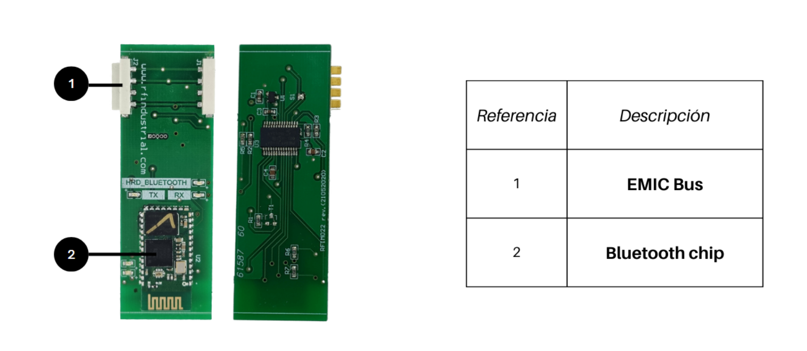

# Bienvenido al repo de desarrollo colaborativo - EMIC
## Una iniciativa para compartir experiencias y mejorar la productividad de programadores de sistemas embebidos.

### ¿Que es EMIC?

EMIC significa Electrónica Modular Inteligente Colaborativa. Está compuesto por: un conjunto de funciones y drivers, un editor de script simple e intuitivo que junto con un sistema de integración, puede crear código listo para compilar o ejecutar.

En un principio EMIC fué creado para crear programas en lenguaje C, pero en el último tiempo se puso a prueba en desarrollo de paginas web (HTML, CSS y JS). Con muy buenos resultados.

Además, EMIC es agnóstico respecto a la arquitectura, familia de microcontroladores y compiladores. Y se busca que las funciones y drivers aportados por los usuarios también lo sean.

### Breve historia: 

Todo comenzó cuándo un grupo de programadores intercambiaba código con el fin de mejorar la productividad y calidad de sus desarrollos.

Vieron que la eficiencia podría mejorar si todo el código desarrollado, cumplía con cierta normalización y buenas prácticas, y comenzaron a redactar las reglas para que las funciones puedan reutilizarse de forma automática, incluso sin la necesidad de comprender a fondo el funcionamiento del código desarrollado por otros programadores.

Con el correr del tiempo la cantidad de código generado fue creciendo y hubo que organizarlos en carpetas. Pudiendo separar, de esta manera, las funciones que utilizan recursos de bajo nivel y las que pertenecen a distintas capas de abstracción, la [lógica de negocio ](#1 "conjunto de algoritmos que realizan el trabajo que el usuario desea ejecutar")  y la descripción del hard.  

Más tarde se crea una aplicación de consola que siguiendo paso a paso un archivo de comandos automatiza la creación de código. Esto marcó un cambio fundamental, principalmente, porque cuando el código generado está basado en funciones que ya fueron probadas, casi siempre funciona a la primera. Dependiendo solamente de la lógica de negocio. Los tiempos de desarrollo se redujeron de meses a días 

Las reglas originales van evolucionando con el paso del tiempo, se agregan la definición de drivers con funciones no bloqueantes, máquinas de estado y bibliotecas genéricas. EL sistema completo se convirtió de esta manera en un [*sistema multi-tarea cooperativo*](https://es.wikipedia.org/wiki/Multitarea_cooperativa "ver en wikipedia")

Unos meses más tarde se agregó un intérprete de comandos extremadamente liviano, esto permitió que las funciones puedan ejecutarse desde comandos externos, desde cualquier puerto habilitado a tal fin.

Se crea un entorno de desarrollo en la nube, que incluye editor, generador de código y compilador, esta nueva herramienta permite generar la lógica de negocio de forma intuitiva y rápida, evitando errores de sintaxis. En esta etapa la plataforma permite utilizar hardware y firmware existente para crear equipos electrónicos en pocos minutos.

Posteriormente se diseña un protocolo para comunicar microcontroladores, esto permite modularizar los desarrollos, de forma que cada parte de un dispositivo electrónico puede recombinarse. Este sistema modular permite crear nuevos dispositivos en pocos minutos combinando módulos de hardware existentes. EMIC está pensado para que el desarrollador de sistemas embebidos viva una experiencia única. Logrando productos robustos y confiables en tiempo record.

### Convocatoria:

El sistema sigue evolucionando, y para acelerar el crecimiento convocamos a todos los interesados a participar de esta gran experiencia de desarrollo colaborativo. La invitación va dirigida tanto a personas que tienen un camino recorrido en el mundo de los embebidos, como a quienes están dando sus primeros pasos, las contribuciones esperadas pueden ser: simples comentarios, validación de código, aporte de ideas, funciones, drivers, diseño de hardware etc.

Si bien, el aporte de más desarrolladores y usuarios que validen cada pieza de la plataforma es importante para la comunidad. No es necesario compartir todo el código creado, cada usuario puede trabajar en forma privada y luego decidir que quiere compartir con el resto. 

### Estado actual de EMIC.

El proyecto EMIC es dinámico, semana tras semana se crean nuevas funciones, drivers completos y nuevo hardware, es por eso que las posibilidades de aplicaciones crecen.

Hoy EMIC cuenta con 50 módulos de hardware. Entre los que se encuentran los módulos de conectividad (WiFi, Bluetooth, LoRa WAN, radios con modulación FSK y LoRa, RS485, RS232); Módulos de display (siete segmentos y gráficos); sensores (temperatura, humedad, corriente, tensión, celdas de cargas, gases, etc); actuadores (relés, motores paso a paso, triacs, salidas PWM, etc ); entradas y salidas digitales y analógicas; entre otros.

Respecto al firmware, podemos nombrar: comunicación SPI, I2C, Uart; Timers, salidas PWM, contadores, interrupciones, conversores AD, protocolos: MQTT, HTTP, JSON parser; controladores para ESP8266, sensores DHT22, DHT11, ADS1231, motores PXP, seven segment; MQ14 

## Generación de Aplicaciones y documentos.

En la etapa de integración, se crea el *script* mediante un proceso de edición utilizando la herramienta disponible en la web https://editor.emic.io. Es decir el sistema toma el documento creado en el proceso de edición del *script* y los transforma en código para un lenguaje de programación específico, como por ejemplo C, LaTex, Javascript  o HTML ( Tutorial edicion de *script* ).

Luego, el sistema utilza el código generado y junto con las bibliotecas alojadas en los repositorios utilizados en el proyecto, crea los documentos listo para compilar (en caso de c o latex), o para publicar (en caso de python, JS, HTML, etc.).

Cuando el integrador comienza a editar el *script*, primero debe elegir que módulos integrarán la solucuion a diseñar, para ello, se le mostrará una lista con todos los módulos disponibles, que pueden ser módulos de hardware, aplicaciones que corren en la nube, dashboard, modelos de Inteligencia artificial, etc. La lista de módulos esta en crecimiento y son el aporte de los desarrolladores expertos.

Una vez que fueron seleccionados los módulos, comienza la edicion del *Script* de cada uno, para ello cuenta con un conjunto de recursos disponibles específico para tipo de módulo que se está editando. Estos recursos son llamados bibliotecas o drivers, y forman parte de la difinición de cada módulo, tambien son aportados por los desarrolladores expertós, podemos decir que un módulo está definido por un conjuntos de driver. Cabe aclarar un driver puede estar incluido en mas de un módulo.

EL proceso de creación de drivers, bibliotecas y módulos que realiza un desarrollador experto es similar a la creación de aplicaciónes o documento de forma tradicional, donde se usa cualquier editor de texto. El desarrallodor crea los fragmentos de código que luego formará parte de la solución integrada, dentro de ese conjunto de bibliotecas estan las llamadas apis, que son las bibliotecas que se utilzan como conexión entre el *Script* y el código aportado por los desarrolladores.

La única deferencia entre una api y las otras bibliotecas es que algunos fragmentos de código de las apis tienen asociado metatexto, es decir una descripción para que un proceso del sistema EMIC, llamado Discovery reconozca el metatexto para presentar la entrada a la librería como un recurso disponible para ser usado en el *Script* por el integrador.

## Modulos.

Los módulos EMIC son el elemento central del sistema, es para el desarrollador el objetivo final y para el integrador el comienzo. En decir que es la interface entre los dos mundos.
Existen distintos tipos de módulos, los que representan a un hardware específico y sus capacidades o funciones, los que definen a una interface visual en la nube, los que definen una aplicación para teléfonos móviles o tablets y PC, y los que definen un proceso alojado en un servidor como bases de datos; procesos backends; e instancias modelos de inteligencia artificial.
A si vez los módulos EMIC, estan compuestos por drivers, que son un grupo de funciones y características, podriamos decir que los módulos estan definidos por un conjunto de drivers, ademas de tener otros elementos que los describen.
A continuacion de muestra un ejemplo de la definición de un módulos de harware con funciones de comunicación Bluetooth:

  

    
  

  

    
  

En la definicion se pueden observar en la linea 1 la definición del nombre del módulo, en la linea 2 se define una macro que hace referencia al micronotrolador utilizado, luego continua el comando **_#insertFile_(_pcb\pcb.emic,pcb=HRD_BLUETOOTH_V1.0)**

Linea

## Organización de archivos y carpetas en **SOURCE Documents:**.

EMIC  
    [_api](#_api)  
    [_drivers](_drivers)  
    [_hard](_hard)  
    [_hal](_hal)  
    [_interprete](_interprete)  
    [_modulos](_modulos)  
    [_OS](_OS)   
    [_pcb](_placas)   
    [_templates](_templates)   
    [_util](_util)   
  

### _api.

En la carpeta [_api](_api) están contenidos las funciones que tienen conexión con la lógica de negocio, es decir, puede tener funciones o variables que pueden ser accedidas desde el *script*.

Los recursos almacenados (funciones y variables, en el caso de la creación de código) en _api, se describen en archivos de texto destinados a tal fin. 

### _drivers, _hard, _hal _util, _pcb, _OS, _main, _interprete, _templates.

En estas carpetas hay código que si bien cumplen distintas funciones (en correspondencia con su nombre) no recibe ningún tratamiento especial por parte del sistema. Para que un archivo almacenado en esta carpeta forme parte de una aplicación, deberá ser invocada por un recurso de nivel superior.

### _modulos.

En esta carpeta se almacena la descripción de los recursos de mayor nivel llamdos módulos. Que a su vez están compuestos por otros recursos definidos en la carpeta _api

### Funcionamiento.

Como plataforma colaborativa, el propósito principal de EMIC es generar distintos tipos de documentos, como programas ejecutables por los módulos electrónicos, aplicaciones de teléfonos inteligentes o tablets y páginas webs.

Los ingredientes necesarios para generar estas aplicaciones y documentos se dividen en dos clases:

  1. El material creado por los usuarios expertos en distintas áreas del conocimiento. Dentro de esta categoría están incluidos archivos en distintos formato estándar. Por ejemplo:

      * Código C (*.c)
      * Header (*.h)
      * Web (*.html, *.css, *.js)
      * Latex (*.tex)
      * Markdown (*.md)

  Estos archivos van acompañados de metatexto y comandos que el sistema interpreta para saber como tratarlos.

  2. El *script* creado por cualquier usuario (incluyendo a los expertos). La herramienta utilizada para esta tarea es el [editor EMIC](https://editor.emic-io) edición del tipo *drag&drop*  dentro de un entorno intuitivo. Donde además de código se pueden editar páginas web de manera y pantallas gráficas de manera visual.
  
En otras palabras, en una aplicación EMIC se fusionan el conocimiento y la experiencia de desarrolladores e integradores y generan un resultado de alta calidad.

Vemos en el diagrama de funcionamiento, los distintos pasos para crear una aplicación web o un dispositivo electrónico.
El sistema esta formado por cuatro procesos que transforman distintos  documentos de entrada en otros de salidas (EMIC Discovery, EMIC Transcriptor, EMIC Marge, EMIC Compiler), tres almacenes de documentos (SOURCE Documents, Intermediate Documents, y FINAL Documents) y un editor de Script.

**EMIC Discovery:** este proceso es el encargado transformar los documentos alojado en *Source Documents* en información utilizada por el editor, es decir que genera una lista de recursos que luego pueden ser utilizados por quien edita el escript.

**EMIC Transcriptor:** este proceso parte del script editado por el usuario y genera un documento que contiene la misma información pero en un formato diferente.

**EMIC Merge:** partiendo del los documentos originales y del script transcripto, este proceso genera documentos que pertenecen a distinto formatos estándares como código C, latex, HTML, javascript, etc.

**EMIC Compiler:** en caso que los documentos generados por EMIC marge necesiten ser compilados, este proceso se encarga de ejecutar al compilador que corresponde dependiendo del tipo de documento generado.

**Intermediate Documents:** almacén donde residen los documentos generados por el transcriptor.

**TARGET Documents:** acá se almacena el primer resultado útil,

**SOURCE Documents:** es donde se almacenan los documentos creados por los desarrolladores del código fuente, este código va acompañado por información adicional, que describe el comportamiento dentro del sistema. Esta único lugar donde los usuarios ingresan documentos en forma directa y donde los desarrolladores compartimos código con el resto. Dada la importancia de esta carpeta se dedicará una sección para explicarla en detalle su estructura.

[#1]: conjunto de algoritmos que realizan el trabajo que el usuario desea ejecutar
